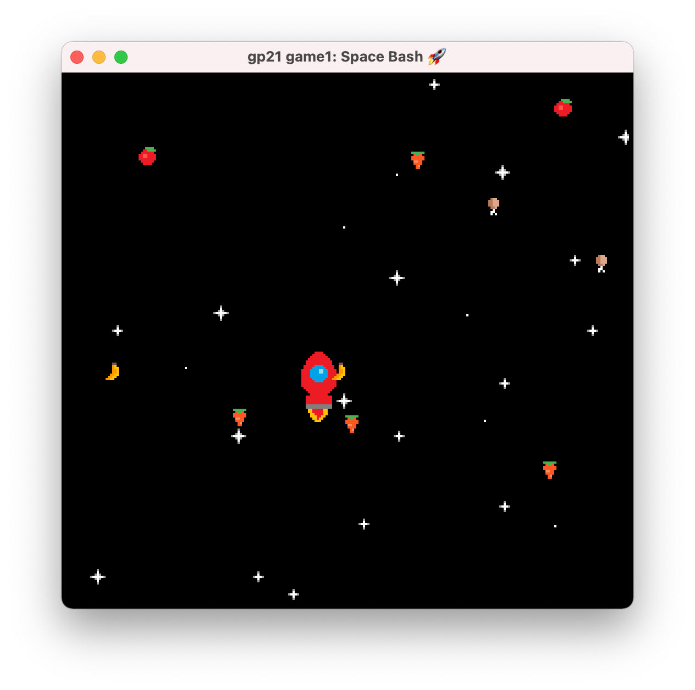

# Space Bash 🚀

Author: Sacha Bartholme

Design: The game consists of a space rocket trying to avoid colliding with foods coming in from all four directions.

Screen Shot:

How Your Asset Pipeline Works:

1) A [.pixil file](assets.pixil) is drawn on [pixilart.com](https://www.pixilart.com/draw)
2) The file is exported to a [.png file](assets.png) on the website
3) The asset pipeline will read the RGBA pixels of the png file
4) The tiles memory is arranged according to the pixels of the png file. The palette table is populated automatically and optimited (e.g. if two tiles can be drawn with the same palette, then only one palette is used). A mapping from tile index to palette index is produced.
4) The background is tiled and the sprites are generated using the tile-to-palette mapping.

How To Play:

Try to avoid colliding with the food projectiles by pressing the arrows. The game stops after the first collision.

This game was built with [NEST](NEST.md).

